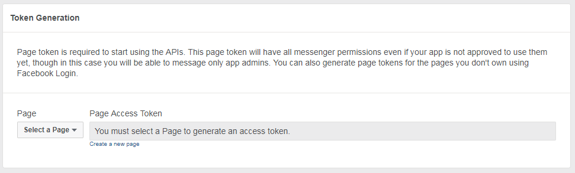
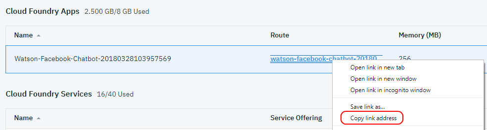
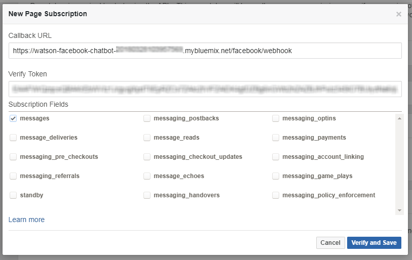
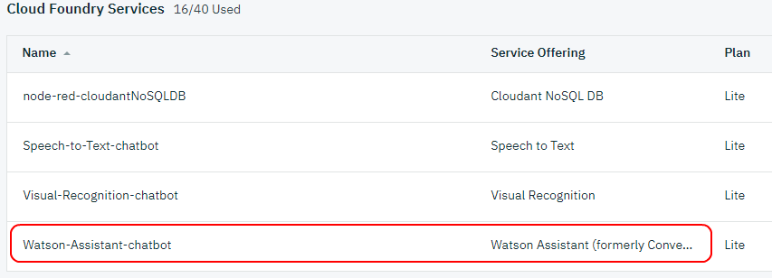
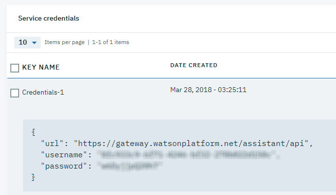
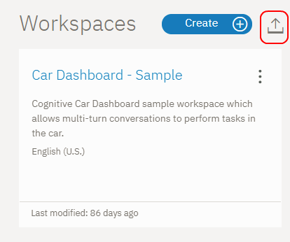

# Build smart chatbot using Watson services

Every day Chatbots become more and more powerfull and accessible , you can find them in every online shop or insurance company site and even in some health care provicers , they give us the ability to help our customers without "spending" human resources for simple customer services that can be provided by bot.

The main challenge we are facing today in this area of chatbots are the ability to cover all the possibles answers to every question or request from the client , another challenge that we are currently facing is how to make a chatbot communicate with variety input options like pictures and voice.

In this guide we will use IBM Watson services to build unique chatbot that can communicate in variety ways like pictures , voice and text. this chatbot uses Watson Assistant , Visual Recognition and speech to text services. this chatbot will be able to help customers of cell phones repair shop and give them advice about phone problems.

# Flow

  
1 – User input a request or ask question about his phone problem. 
2 – The facebook messanger of the facebook page will notify the facebook api that we got incoming message. 
3 – The facebook api will send to our node-red backend server the request with the user input. 
4 – Our node-red backend server will analyze the user input and will decide which service should handle it (visual recognition if its image , speech to text if its voice and watson assistant if its simple text. 
5 – After the node-red decide what answer to send back it will send it to the facebook api. 
6 – The facebook api will send the message back to the facebook messanger. 
7 – The facebook messanger will send the message back to the user. 

# Included Components
* [Watson Assistant](https://console.bluemix.net/docs/services/conversation/getting-started.html):
  With the IBM Watson™ Assistant service, you can build a solution that understands natural-language input and uses machine learning to respond to customers in a way that simulates a conversation between humans.

* [Watson Visual Recognition](https://console.bluemix.net/docs/services/visual-recognition/getting-started.html):
  The IBM Watson™ Visual Recognition service uses deep learning algorithms to analyze images for scenes, objects, faces, and other content. The response includes keywords that provide information about the content.

* [Speech to Text](https://console.bluemix.net/docs/services/speech-to-text/index.html):
  The IBM® Speech to Text service provides Application Programming Interfaces (APIs) that let you add speech transcription capabilities to your applications. To transcribe the human voice accurately, the service leverages machine intelligence to combine information about grammar and language structure with knowledge of the composition of the audio signal. The service continuously returns and retroactively updates a transcription as more speech is heard.
  
* [Node-Red](https://www.eu-gb.bluemix.net/docs/#starters/Node-RED/nodered.html#nodered):
  Node-RED provides a browser-based flow editor that makes it easy to wire together devices, APIs, and online services by using the wide range of nodes in the palette. Flows can be then deployed to the Node.js runtime with a single click.

# Steps
1. [Prerequisites](#1-prerequisites)
2. [Application deployment](#3-application-deployment)
3. [Create facebook page and get facebook token](#4-create-facebook-page-and-get-facebook-token)
4. [Upload workspace to Watson Assistant](#5-upload-workspace-to-watson-assistant)
5. [Connect all together](#6-connect-all-together)
6. [Communicate with your new chatbot](#7-communicate-with-your-new-chatbot)

### 1. Prerequisites
- IBM Cloud account: If you do not have an IBM Cloud account, you can create an account [here](https://console.bluemix.net/).

### 2. Application deployment

##### 2.1 Deploy using "Deploy to IBM Cloud"
Click `Deploy to IBM Cloud` button above to deploy the application to IBM Cloud. You would
be presented with a toolchain view and asked to "Deploy" the application. Go ahead and
click `Deploy` button. The application should get deployed. Ensure that the application
is started and that a Watson Assistant , Visual Recognition and Speech to text services are created and bound to the application just deployed.  

### 3. Create facebook page and get facebook token

#### 3.1 Create facebook page
Click [here](https://www.facebook.com/business/learn/set-up-facebook-page) to set up your facebook page.
#### 3.2 Get facebook token
Go to [Facebook Developer Site](https://developers.facebook.com/apps/) and follow the steps :
1. log in with the facebook account that created you facebook page.
2. click on "Add a New App" , and give it a name.
3. enter to the App page and click on the "Messenger" on the left menu and click on "settings".
4. scroll down to "Token Generation" section and select your facebook page.
  
5. copy the facebook token for later use.
6. scroll down to "Webhooks" and click on "Setup Webhooks".
7. go to the [IBM Cloud dashboard](https://console.bluemix.net/dashboard/apps).
8. find your app under the "Cloud Foundry Apps" and copy the App URL.
  
9. go back to the Webhooks Setup page and paste the APP URL in the Callback URL with suffix of "/facebook/webhook" , paste the facebook token and check the "messages", then click "Verify and Save".
  

### 4. Upload workspace to Watson Assistant

1. go to the [IBM Cloud dashboard](https://console.bluemix.net/dashboard/apps).
2. click on the "Watson-Assistant-chatbot" service.
  
3. on the left menu click on "Service credentials".
4. create new credentials by clicking on the "New credential" button.
5. click on "add" button.
6. click on "View credentials" and copy the Username and Password for later use.
  
7. go back to "Manage" section from the left menu.
8. and click on "Launch tool" button.
9. find the "Upload" button to upload the workspace json , you can find him inside the "workspace" folder in this repository.
  

### 5. Connect all together

### 6. Communicate with your new chatbot

# References

# Learn more

# Next Steps

# License
[Apache 2.0](LICENSE)
